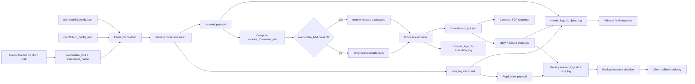
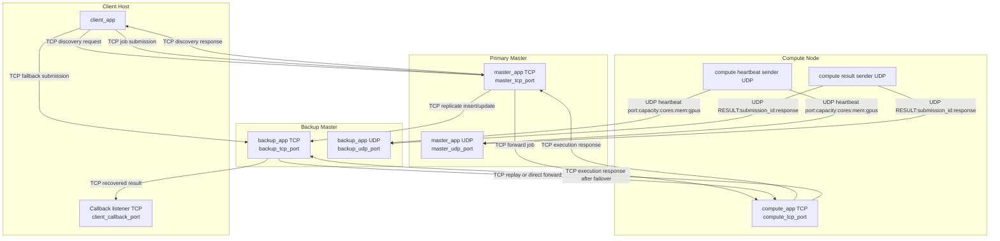

# Cluster Middleware Design Document

## System Summary

At a high level, the system works like this:

1. A client reads a job definition from JSON.
2. The client embeds the executable into the payload as base64.
3. The client submits that payload to the primary master over TCP.
4. The primary master persists the job, replicates metadata to the backup master, selects a compute node, and forwards the payload.
5. The compute node executes the job and returns results.
6. The compute node also broadcasts completion state over UDP so both primary and backup can track progress.
7. If the primary fails, the backup promotes itself and can recover pending work using persisted state plus compute result notifications.

## Main Components

### Client

Primary responsibilities:

- Read client networking config from `client/client_config.json`
- Read a job definition such as `client/config/config.json`
- Open a recovery listener on a callback TCP port
- Base64-encode the executable referenced by the job config
- Discover the backup master through the primary when possible
- Submit the job to primary, then fall back to backup if the primary is unavailable

Important runtime behavior:

- The client adds `client_callback_address` and `client_callback_port` into the job payload.
- The client also adds `executable_name` and `executable_b64`.
- If the master connection closes without a direct response, the client keeps listening for a later recovery response from the backup master.

### Primary Master

Primary responsibilities:

- Accept client job submissions over TCP
- Assign `submission_id` and `receipt_id`
- Store accepted jobs in `jobs_log`
- Replicate inserts and updates to the backup master
- Track compute nodes through UDP heartbeats
- Choose a compute node based on capacity and resource availability
- Forward jobs to compute nodes over TCP
- Update durable job state when compute completion is reported

Important runtime behavior:

- The primary handles a special discovery request: `{"request":"discover_backup"}`.
- Before forwarding work, it serializes the job into `forward_payload`.
- It retries scheduling up to three times if a selected compute node fails transport-level delivery.

### Backup Master

Primary responsibilities:

- Receive replicated job state from the primary
- Maintain its own live view of compute heartbeats
- Probe the primary master and determine when it is unavailable
- Promote itself to active master after configured failures
- Accept client jobs after promotion
- Recover pending jobs from durable state
- Deliver recovered responses to the client callback listener

Important runtime behavior:

- Replication arrives as TCP payloads with `"request":"replicate"` and an `"action"` of `insert` or `update`.
- The backup stores compute `RESULT:` notifications from UDP even before promotion.
- Recovery logic scans pending jobs and either:
  - returns an already stored `response_status`, or
  - replays the stored `forward_payload` to a live compute node

### Compute Node

Primary responsibilities:

- Publish heartbeat telemetry to primary and backup via UDP
- Accept forwarded jobs over TCP
- Decode embedded executables from base64
- Write uploaded executables to temporary files in `/tmp`
- Execute the job and capture stdout/stderr
- Persist execution state in SQLite
- Return completion state over both TCP and UDP

Important runtime behavior:

- Heartbeats carry both abstract capacity and hardware-style availability.
- Compute decrements in-memory free resources before execution and restores them after execution.
- The result is sent to the connected master over TCP and also broadcast over UDP to both primary and backup in the format `RESULT:<submission_id>:<response>`.

## Configuration Design

## Client Config

File: `client/client_config.json`

| Key                         | Type   | Purpose                                          |
| --------------------------- | ------ | ------------------------------------------------ |
| `master_address`          | string | Primary master address for job submission        |
| `master_tcp_port`         | int    | Primary master TCP port                          |
| `backup_address`          | string | Backup master address for client fallback        |
| `backup_tcp_port`         | int    | Backup master TCP port                           |
| `client_callback_address` | string | Address backup uses to deliver recovered results |

## Client Job Config

File: `client/config/config.json`

| Key               | Type          | Purpose                               |
| ----------------- | ------------- | ------------------------------------- |
| `name`          | string        | Logical job name                      |
| `executable`    | string        | Executable path on the client machine |
| `priority`      | int           | Scheduling priority                   |
| `time_required` | int           | Requested runtime metadata            |
| `min_memory`    | int           | Minimum memory requirement in MB      |
| `min_cores`     | int           | Minimum CPU core requirement          |
| `max_memory`    | int           | Maximum memory metadata               |
| `gpu_required`  | int, optional | GPU requirement, default `0`        |

Submission-time payload augmentation performed by the client:

- `client_callback_port`
- `client_callback_address`
- `executable_name`
- `executable_b64`

## Primary Master Config

File: `master/master_config.json`

| Key                           | Type          | Purpose                                     |
| ----------------------------- | ------------- | ------------------------------------------- |
| `tcp_address`               | string        | TCP bind address                            |
| `tcp_port`                  | int           | TCP listen port for clients                 |
| `udp_address`               | string        | UDP bind address                            |
| `udp_port`                  | int           | UDP port for heartbeats and compute results |
| `backup_address`            | string        | Backup master address                       |
| `backup_tcp_port`           | int           | Backup master TCP port                      |
| `backup_connect_timeout_ms` | int           | Replication connection timeout              |
| `heartbeat_timeout_ms`      | int, optional | Compute liveness timeout                    |
| `monitor_interval_ms`       | int, optional | Compute-death monitor interval              |

## Backup Master Config

File: `master/backup_config.json`

| Key                           | Type          | Purpose                          |
| ----------------------------- | ------------- | -------------------------------- |
| `tcp_address`               | string        | Backup TCP bind address          |
| `tcp_port`                  | int           | Backup TCP listen port           |
| `udp_address`               | string        | Backup UDP bind address          |
| `udp_port`                  | int           | Backup UDP listen port           |
| `primary_address`           | string        | Primary master address           |
| `primary_tcp_port`          | int           | Primary master TCP port          |
| `primary_check_interval_ms` | int           | Health-check interval            |
| `primary_check_timeout_ms`  | int           | Health-check timeout             |
| `primary_failure_threshold` | int           | Failures before promotion        |
| `primary_startup_grace_ms`  | int           | Grace delay before checks matter |
| `heartbeat_timeout_ms`      | int, optional | Compute liveness timeout         |
| `monitor_interval_ms`       | int, optional | Compute monitor interval         |

## Compute Config

File: `compute/compute_config.json`

| Key                             | Type          | Purpose                        |
| ------------------------------- | ------------- | ------------------------------ |
| `compute_address`             | string        | Compute TCP bind address       |
| `compute_tcp_port`            | int           | Compute TCP listen port        |
| `master_address`              | string        | Primary master UDP destination |
| `master_udp_port`             | int           | Primary master UDP port        |
| `backup_address`              | string        | Backup master UDP destination  |
| `backup_udp_port`             | int           | Backup master UDP port         |
| `compute_available_resources` | int           | Scheduler capacity score       |
| `compute_free_cores`          | int           | Available CPU cores            |
| `compute_free_memory_mb`      | int           | Available memory in MB         |
| `compute_free_gpus`           | int           | Available GPUs                 |
| `heartbeat_interval_ms`       | int, optional | Telemetry interval             |

## Payload Design

There are three important payload shapes in the current implementation.

### 1. Raw client job payload

This starts from the client job config and is extended at send time with callback and executable-upload fields.

Representative fields:

- `name`
- `executable`
- `priority`
- `time_required`
- `min_memory`
- `min_cores`
- `max_memory`
- `gpu_required`
- `client_callback_address`
- `client_callback_port`
- `executable_name`
- `executable_b64`

### 2. Master forward payload

The primary and backup convert the accepted client job into a stable `forward_payload`. This payload is important because it is stored durably and reused for replay.

Representative fields:

- `submission_id`
- `receipt_id`
- `sender`
- `name`
- `username`
- `executable`
- `executable_name`
- `executable_b64`
- `priority`
- `time_required`
- `min_memory`
- `min_cores`
- `max_memory`
- `gpu_required`

### 3. Replication payload

The primary master sends job state to the backup using TCP replication messages.

Insert replication carries:

- `request = replicate`
- `action = insert`
- `submission_id`
- `job_name`
- `sender`
- `forwarding_status`
- `response_status`
- `client_callback_address`
- `client_callback_port`
- `forward_payload`

Update replication carries:

- `request = replicate`
- `action = update`
- `submission_id`
- `forwarding_status`
- `response_status`
- `delivery_status`

## Data Persistence Design

## Primary and Backup Database

Database file used when running from `master/`:

- `master_logs.db`

Table: `jobs_log`

| Column                      | Type                     | Meaning                                                        |
| --------------------------- | ------------------------ | -------------------------------------------------------------- |
| `id`                      | INTEGER PK AUTOINCREMENT | Local log row id                                               |
| `submission_id`           | INTEGER                  | Cluster job id                                                 |
| `job_name`                | TEXT                     | Job name                                                       |
| `sender`                  | TEXT                     | Submission source                                              |
| `forwarding_status`       | TEXT                     | Forwarding state                                               |
| `response_status`         | TEXT                     | Compute response text or `PENDING`                           |
| `client_callback_address` | TEXT                     | Recovery callback address                                      |
| `client_callback_port`    | INTEGER                  | Recovery callback port                                         |
| `forward_payload`         | TEXT                     | Stored replayable compute payload                              |
| `delivery_status`         | TEXT                     | Delivery marker such as `PENDING`, `DIRECT`, `RECOVERED` |
| `timestamp`               | DATETIME                 | Last update timestamp                                          |

Why this matters:

- The backup does not need the client to resubmit work.
- The backup does not need the compute filesystem to reconstruct the original job request.
- A job can be recovered either from a stored compute response or by replaying the stored `forward_payload`.

## Compute Database

Database file:

- `compute/compute_logs.db`

Table: `execution_log`

| Column                | Type                     | Meaning                      |
| --------------------- | ------------------------ | ---------------------------- |
| `id`                | INTEGER PK AUTOINCREMENT | Log row id                   |
| `submission_id`     | INTEGER                  | Cluster job id               |
| `job_name`          | TEXT                     | Job name                     |
| `executable`        | TEXT                     | Actual executed path         |
| `execution_state`   | TEXT                     | `RUNNING` or `COMPLETED` |
| `return_code`       | INTEGER                  | Process exit code            |
| `completion_status` | TEXT                     | Captured result text         |
| `timestamp`         | DATETIME                 | Last update timestamp        |

## Scheduling Design

Compute nodes advertise themselves through UDP heartbeats in this format:

`port:available_resources:free_cores:free_memory_mb:free_gpus`

The primary and backup both maintain an in-memory map keyed by `ip:port`.

Selection inputs used by scheduling code:

- abstract available resource score
- available CPU cores
- available memory
- available GPUs

When a node transport failure occurs:

- the selected node is removed from the in-memory map
- the master retries scheduling up to three times

## Failure and Recovery Design

### Normal successful path

1. Client submits to primary.
2. Primary stores and replicates job state.
3. Primary forwards to compute.
4. Compute executes and returns result.
5. Primary updates durable state and responds to client.

### Primary failure before client receives response

1. Client submission may already have been forwarded.
2. Compute may still finish and emit UDP `RESULT`.
3. Backup stores that result in `jobs_log.response_status`.
4. Backup detects primary failure and promotes itself.
5. Backup recovery loop scans jobs where `delivery_status = 'PENDING'`.
6. If `response_status` is already present, backup sends it to the client callback listener.

### Primary failure before compute completion

1. The backup has the replicated `forward_payload`.
2. After promotion, backup replays that payload to an available compute node.
3. Backup delivers the recovered response to the client callback listener.

## Execution Sequence

### Step-by-step

1. `client_app` starts and reads `client/client_config.json`.
2. Client opens a callback listener on a derived port.
3. Client reads a job config such as `client/config/config.json`.
4. Client loads the executable bytes and base64-encodes them.
5. Client tries a discovery handshake with the primary to learn the active backup endpoint.
6. Client sends the job payload over TCP to the primary.
7. Primary parses the payload, generates ids, and creates `forward_payload`.
8. Primary inserts a row into `jobs_log`.
9. Primary replicates the insert to backup.
10. Primary selects a compute node from the heartbeat pool.
11. Primary forwards `forward_payload` over TCP to compute.
12. Compute decodes the forwarded job.
13. If `executable_b64` exists, compute creates a temporary executable under `/tmp`.
14. Compute marks the temp file executable and runs it.
15. Compute updates `execution_log` to `RUNNING`, then later to `COMPLETED`.
16. Compute sends the execution result over TCP to the connected master.
17. Compute also sends UDP `RESULT:<submission_id>:<response>` to both primary and backup.
18. Primary updates `jobs_log.response_status`.
19. Primary responds to the client.
20. If primary is gone, backup can still recover from persisted state and callback delivery.

## Mermaid Data Flow

This diagram focuses on data objects, storage, and transformation between stages.

## Mermaid Network Flow

This diagram focuses on transport channels, ports, and protocol direction between runtime nodes.

## Operational Notes

- The current implementation uses a lightweight string-based config parser rather than a full JSON library.
- The client job config is stricter than the system config files and will fail fast on missing required job fields.
- The backup can answer direct client requests only after promotion or when the client explicitly falls back and the primary is unreachable.
- Both masters build their compute-node view independently from UDP heartbeats.
- The same durable job schema exists in both primary and backup code paths so replication and replay stay simple.
